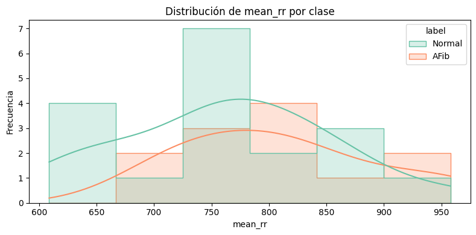

# Clasificación de ECGs para detección de Fibrilación Auricular
### Autor: Yanko Acuña Villaseca

## Introducción
La fibrilación auricular (AFib) es una arritmia cardíaca común que, si no se detecta a tiempo, puede derivar en accidentes cerebrovasculares u otras complicaciones graves. Su diagnóstico mediante electrocardiogramas (ECGs) es crucial, pero muchas veces se requiere la intervención de un especialista para su detección adecuada. Dado este contexto, se busca aplicar modelos de inteligencia artificial que permitan predecir si un ECG pertenece a una clase normal o representa un riesgo (AFib), automatizando parcialmente el proceso de tamizaje.

Este trabajo propone un enfoque de clasificación binaria basado en la extracción de características estadísticas de la señal ECG y el entrenamiento de modelos de aprendizaje automático.

## Descripción del problema
El objetivo es predecir el diagnóstico general de un ECG, determinando si pertenece a un patrón normal o presenta fibrilación auricular. Para ello, se extraen métricas relevantes de la señal, como intervalos RR y medidas de variabilidad, y se entrena un modelo neuronal **MLPClassifier** para realizar la clasificación. Se exploran distintas arquitecturas y funciones de activación, buscando optimizar el rendimiento en términos de precisión, recall y F1-score.

## Descripción de los datos
Los datos utilizados provienen de la base de datos **PhysioNet**, y se consideran únicamente los registros anotados como **Normal (N)** o **AFib (A)**. Se eliminaron los registros con ruido debido a que afectan al entrenamiento, y se descartaron los registros anotados como others, debido a que el objetivo es identificar entre normal y AFib. A partir de los archivos .mat correspondientes a cada ECG, se procesa la señal en una única derivación y se normaliza. Se detectan los picos R, y con base en ellos se calculan los siguientes atributos:

- Media y desviación estándar de intervalos RR.
- Asimetría (skew) y curtosis.

Estas características se almacenan en un archivo CSV para facilitar futuras ejecuciones.

## Exploración de los datos

Antes del entrenamiento del modelo, se realizó una exploración inicial de 30 datos extraídos. Se analizaron la distribución de las variables numéricas (como los intervalos RR) y su comportamiento según la clase (Normal o AFib). Esta etapa permitió identificar posibles sesgos, outliers y diferencias entre clases.

A continuación, se presentan las distribuciones por clase de las principales variables extraídas:

### Distribución de variables por clase

#### Distribución de mean_rr

#### Distribución de std_rr

#### Distribución de skew_rr

#### Distribución de kurt_rr

### Análisis de las variables

- **`mean_rr`**: Muestra cierta separación entre clases. Valores más altos predominan en la clase normal, mientras que valores bajos son más frecuentes en AFib.
- **`std_rr`**: Aunque con mayor superposición, AFib tiende a tener mayor dispersión en los intervalos.
- **`skew_rr`**: La clase AFib presenta valores más centrados y altos, mientras que la clase normal tiene una distribución más extendida.
- **`kurt_rr`**: Se observan diferencias marcadas entre clases. AFib tiene una distribución más aplanada, mientras que la clase normal es más concentrada.

### Aspectos destacados del conjunto de datos

- Las variables presentan superposición, pero también diferencias útiles para la clasificación.
- **`skew_rr`** y **`kurt_rr`** destacan por sus patrones diferenciadores.
- El tamaño del conjunto es pequeño, lo cual puede limitar la generalización del modelo si no se complementa con validación adecuada.
- La escala de las variables es distinta, lo que justificó el uso de estandarización antes del entrenamiento.

## Obtención de las métricas de los archivos .mat
Para extraer las características de los archivos `.mat` y calcular las métricas, se siguió el siguiente proceso:

1. **Cargar los archivos .mat**: Los archivos que contienen los datos del ECG fueron leídos y cargados en el sistema para ser procesados. Estos archivos contienen las señales de electrocardiogramas que luego se analizarán.
2. **Normalización de la señal**: La señal del ECG se ajustó para que todos los valores tuvieran una media de 0 y una desviación estándar de 1. Esto ayuda a que los datos sean más consistentes y facilita su análisis, eliminando cualquier sesgo que pueda haber debido a diferencias de escala entre las señales.

3. **Detección de picos R**:  En el ECG, los picos R son puntos clave que indican el latido del corazón. Se identificaron estos picos en la señal, ya que son esenciales para medir el intervalo entre latidos, conocido como intervalo RR.
4. **Cálculo de las características**:
    - **Promedio de los intervalos RR**: Se calculó el promedio de los tiempos entre los latidos del corazón, lo que nos da una idea general de la frecuencia cardíaca.

    - **Desviación estándar de los intervalos RR**: Se midió qué tanto varían los intervalos entre latidos, lo que nos ayuda a entender la regularidad o irregularidad del ritmo cardíaco.

    - **Asimetría de los intervalos RR**: Se evaluó si los intervalos entre latidos tienden a ser más largos o más cortos en un extremo, lo que puede indicar patrones anormales en el ritmo.

    - **Curtosis de los intervalos RR**: Se midió la "altura" y "anchura" de la distribución de los intervalos RR, lo que indica si hay una mayor concentración de latidos en ciertos intervalos o si están más dispersos.

5. **Almacenamiento**:  Todos estos valores calculados fueron guardados en un archivo para que pudieran ser usados más tarde en el proceso de entrenamiento de los modelos, los cuales buscarán identificar patrones en las señales ECG para detectar si hay fibrilación auricular (AFib) o si el ritmo es normal.

## Proceso de entrenamiento y evaluación
El dataset final fue dividido en conjunto de entrenamiento (70%) y prueba (30%), con estratificación por clase. Posteriormente, se estandarizaron los datos con **StandardScaler**.

Se implementó una red neuronal multicapa utilizando **MLPClassifier**, probando distintas configuraciones de capas ocultas, funciones de activación (**relu**, **tanh**, **logistic**) y tasas de aprendizaje. También se aplicó regularización L2 y **early stopping** para evitar el sobreajuste.

### Gráfico de distribución de clases

## Métricas de evaluación
Se calcularon las siguientes métricas para comparar el rendimiento de los modelos: precisión, recall, F1-score y accuracy. A continuación, se presentan algunos resultados con diferentes funciones de activación y porcentajes de datos de entrenamiento:

| Modelo              | Accuracy | Precision | Recall | F1-Score |
|---------------------|----------|-----------|--------|----------|
| MLP ReLU            | 0.9073   | 0.7915    | 0.7904 | 0.7909   |
| XGBoost             | 0.9010   | 0.7851    | 0.7326 | 0.7549   |
| SVM                 | 0.8728   | 0.4364    | 0.5000 | 0.4660   |
| Random Forest       | 0.9056   | 0.7978    | 0.7430 | 0.7663   |
| MLP Tanh            | 0.9016   | 0.7813    | 0.7581 | 0.7689   |
| MLP Logistic        | 0.9016   | 0.7820    | 0.7542 | 0.7670   |

### Selección del modelo
Tras comparar múltiples modelos de clasificación (Random Forest, SVM, XGBoost y distintas variantes del perceptrón multicapa), se seleccionó el modelo MLPClassifier con función de activación ReLU por su mejor desempeño general en todas las métricas evaluadas.

Aunque modelos como Random Forest y XGBoost mostraron adecuados resultados, el MLP con ReLU logró el mejor balance entre precisión (79.15%) y recall (79.04%), lo que es especialmente relevante en contextos clínicos donde es fundamental no pasar por alto casos reales de fibrilación auricular (AFib). Además, alcanzó la mayor exactitud global (90.73%) y un F1-score equilibrado, indicando buena capacidad del modelo para identificar ambas clases sin sesgos significativos.

La elección de la función ReLU también permitió una convergencia más eficiente durante el entrenamiento, mostrando ventajas sobre funciones como tanh o logistic, y ayudando a evitar el problema del desvanecimiento del gradiente.

En resumen, se eligió el MLPClassifier con ReLU por ofrecer el mejor rendimiento técnico y clínico para este conjunto de datos.

### Métricas obtenidas con el modelo **MLPClassifier**
El modelo **MLPClassifier** con activación **ReLU** proporcionó los siguientes resultados:

- **Accuracy**: 0.9073
- **Precision**: 0.7915
- **Recall**: 0.7904
- **F1-Score**: 0.7909

Se observó que el **accuracy** del modelo es relativamente alto, alcanzando un **90.73%**, lo que indica que la mayoría de las predicciones fueron correctas. Sin embargo, la clase minoritaria **AFib** presenta un rendimiento similar en términos de **precision** y **recall** (alrededor de **79%**), lo que sugiere que el modelo logra un buen equilibrio en la detección de ambas clases.

### Evaluación del balance entre precisión y recall
Se observó que la función de activación **ReLU** entrega un mejor equilibrio entre precisión y recall en la clase minoritaria **AFib**, lo que es fundamental para la detección temprana de esta arritmia. El **F1-score** también es alto (**79.09%**), lo que indica que el modelo tiene una buena capacidad para identificar correctamente tanto los positivos como los negativos.

### Matriz de confusión
Se generó una matriz de confusión para visualizar los verdaderos positivos, falsos positivos, falsos negativos y verdaderos negativos del modelo con mejores resultados.

#### Matriz de Confusión

## Conclusiones
El uso de MLPClassifier con características estadísticas extraídas de la señal ECG mostró un rendimiento satisfactorio en la detección de fibrilación auricular (AFib). Aunque el modelo mostró un alto accuracy en general (90.73%), las métricas de precision y recall para AFib (79%) son más representativas de la capacidad del modelo para manejar la clase minoritaria. Esto es esencial en un contexto médico, donde los falsos negativos (no detectar AFib) pueden tener consecuencias graves.

### Limitaciones del modelo

Desbalance de clases: Aunque el modelo mostró buenos resultados, la fibrilación auricular sigue siendo una clase minoritaria, lo que hace que sea más difícil de identificar correctamente.

### Posibles mejoras:

- Aplicación de técnicas de balanceo: Utilizar métodos como SMOTE para generar más ejemplos de la clase minoritaria.

- Exploración de otras características: Incluir características temporales o frecuenciales como la Transformada Rápida de Fourier (FFT) o Wavelets puede ayudar a extraer patrones adicionales de la señal ECG y mejorar el rendimiento.

### Consideraciones éticas
Si bien el modelo puede asistir en la detección temprana de fibrilación auricular, no debe reemplazar el diagnóstico clínico. Toda predicción automatizada debe ser validada por personal médico. Un mal uso de estos sistemas podría derivar en diagnósticos erróneos con impacto en la salud de los pacientes.